# Procesverslag
Markdown is een simpele manier om HTML te schrijven.  
Markdown cheat cheet: [Hulp bij het schrijven van Markdown](https://github.com/adam-p/markdown-here/wiki/Markdown-Cheatsheet).

Nb. De standaardstructuur en de spartaanse opmaak van de README.md zijn helemaal prima. Het gaat om de inhoud van je procesverslag. Besteedt de tijd voor pracht en praal aan je website.

Nb. Door *open* toe te voegen aan een *details* element kun je deze standaard open zetten. Fijn om dat steeds voor de relevante stuk(ken) te doen.

## Jij

  
uitwerken voor kick-off werkgroep

  ### Auteur:
  Jip Hendriks

  #### Je startniveau:
  Blauwe piste

  #### Je focus:
  surface plane

  1. formulier (aanmelden voor de nieuwsbrief)
  2. geluid (Audio afspelen bij het lezen van de blogs)
  3. dark/light mode (op beide pagina's)
  4. Scroll x door sectie (sectie bestsellers en maak het compleet)
  5. DOM manipulatie (gebruik van gemaakt bij het formulier)
  6. advanced positioning (header, button in de eerste sectie)
  7. SVG stijlen en animeren (footer het logo van bloomon, van zwart naar wit gemaakt en geanimeerd met transform rotate)
  8. loading animatie (als je je naam en email hebt ingevuld en klikt op verstuurd krijg je deze te zien, door keyframes rotation)
 

## Je website

  
uitwerken voor kick-off werkgroep

  ### Je opdracht:
  https://www.bloomon.nl/

  #### Screenshot(s) van de eerste pagina (small screen): 
  bloomon homescherm 
  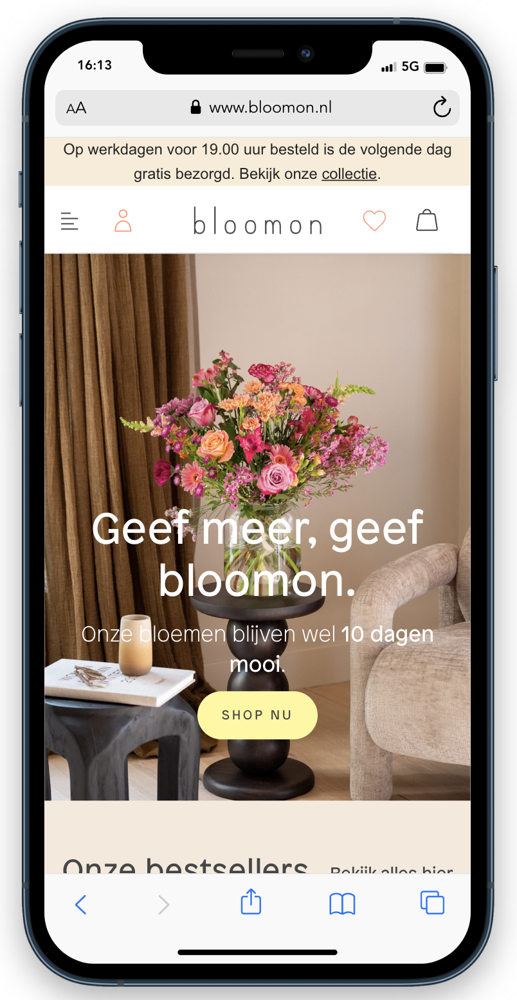

  #### Screenshot(s) van de tweede pagina (small screen):
  bloomon blog scherm floral stories 
  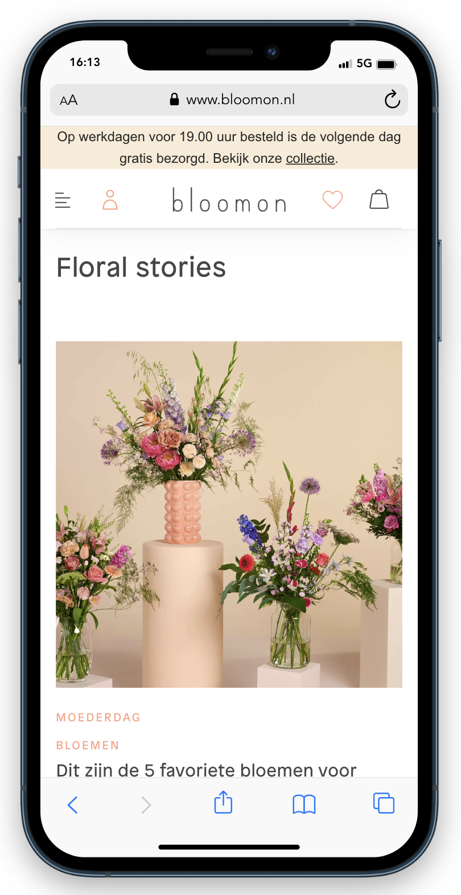
 

## Toegankelijkheidstest 1/2 (week 1)

  
uitwerken na test in 2e werkgroep

  ### Bevindingen
  Lijst met je bevindingen die in de test naar voren kwamen:
   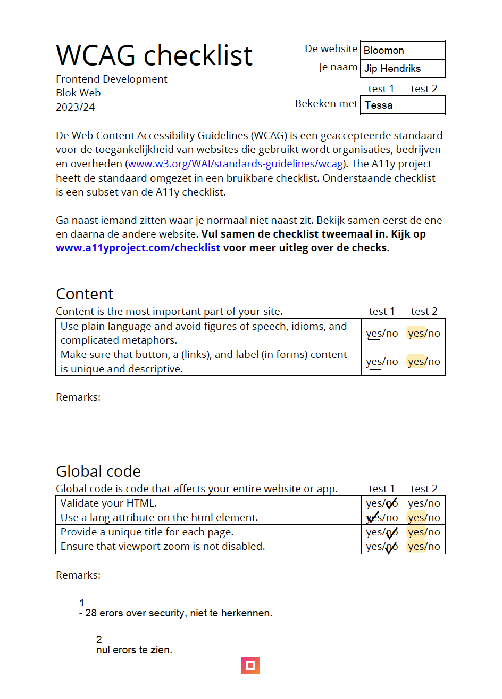
  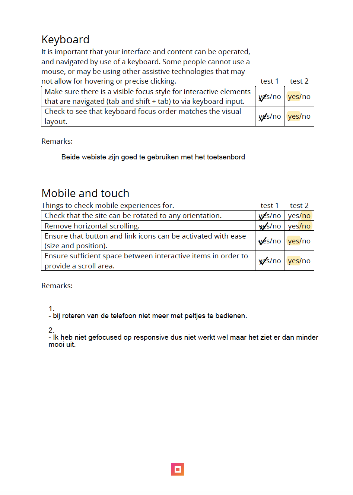
  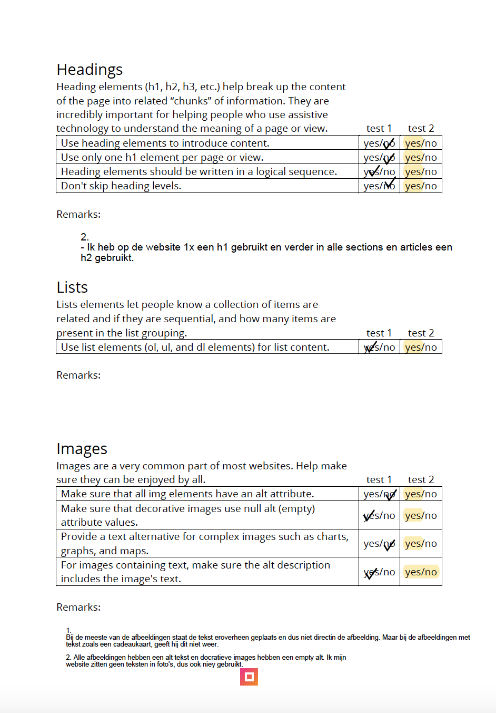
  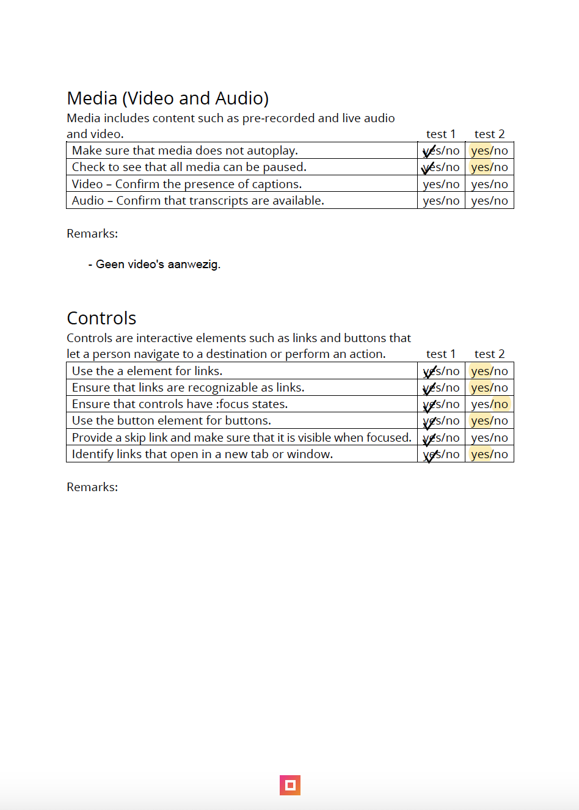
  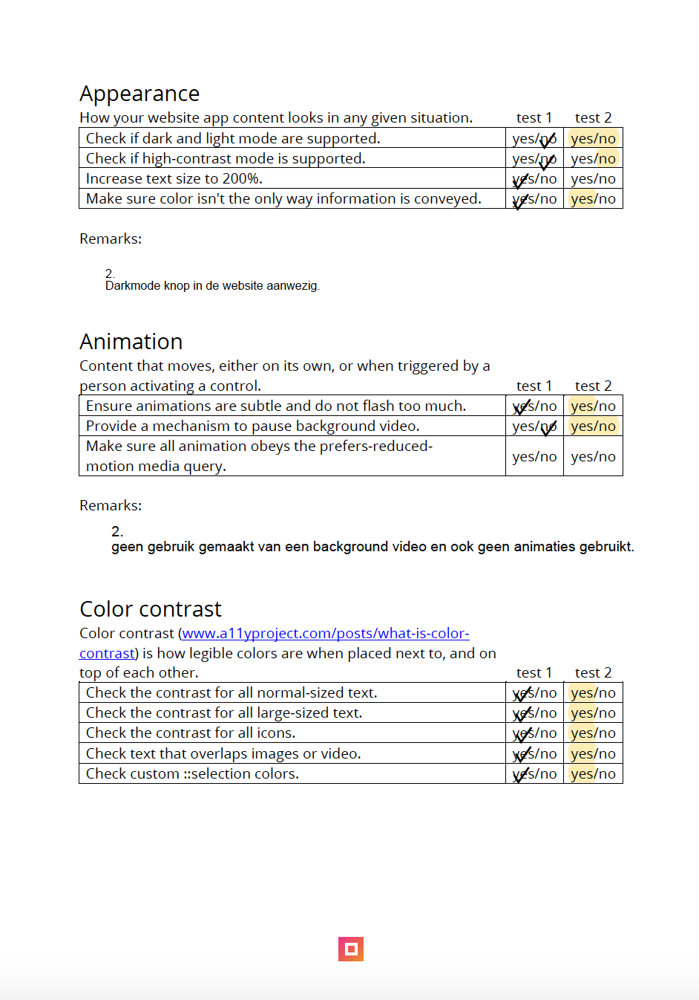

## Breakdownschets (week 1)

  
uitwerken na afloop 3e werkgroep

  ### de hele pagina: 
  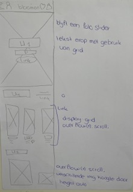

  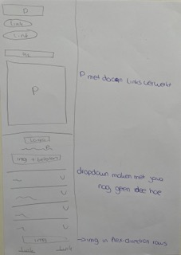

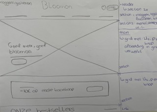

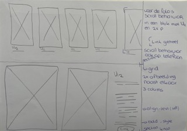

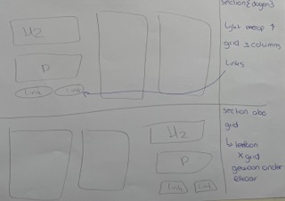

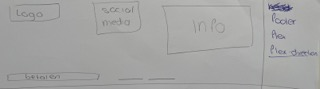

  ### dynamisch deel (bijv menu): 
  
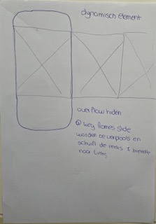
  

## Voortgang 1 (week 2)

  
uitwerken voor 1e voortgang

  ### Stand van zaken
  Ik heb nog niet mega veel gedaann voor mijn website. Ik heb vooral de opdrachten van 
  de lessen gemaakt en gekeken hoe ik deze terug wil laten komen in de website.

  ### Agenda voor meeting
  samen met je groepje opstellen

  | student 1      | student 2          | student 3    | student 4        |
  | ---            | ---                | ---          | ---              |
  | dit bespreken  | en dit             | en ik dit    | en dan ik dat    |
  | en dat ook nog | dit als er tijd is | nog een punt | dit wil ik zeker |
  | ...            | ...                | ...          | ...              |

  deze vorm van gesprekken hebben we niet gevoerd. Ik kan dit dus alleen over mijmelf
  zeggen.

  Ik wil graag feedback over de schetsen die ik gemaakt heb van de pagina's. Ik ga feedback vragen over het gebruik van grid en flex. ook zou ik graag willen kijken naar de uitdagingen van de pagina's.

  ### Verslag van meeting
  hier na afloop snel de uitkomsten van de meeting vastleggen

  - Al goed opweg met te schetsen, niet vergeten om erbij te zetten wat links en wat buttons moeten zijn.
  - Flex en grid gebruik gaat goed, mag alleen wel vaker gebruikt worden.
  - Beginnen met de automatische foto slider
 

## Voortgang 2 (week 3)

  
uitwerken voor 2e voortgang

  ### Stand van zaken

Ik ben begonnen met het maken van de header en de eerste sectie met daarin een automatische foto slider. Daarna ben ik verder gegaan met de rest van de pagina. Ik denk dat ik nu op 75% van de eerste pagina zit wat af is.

  ### Agenda voor meeting
  samen met je groepje opstellen

  ik wil graag bij het feedback gesprek hebben over het volgende:
  1. Of de header moet bestaan uit gewoon foto's of dat er ook links van gemaakt moeten worden.
  2. Of je het menu ook moet uitwerken
  

  ### Verslag van meeting
  hier na afloop snel de uitkomsten van de meeting vastleggen

  - Maak van de afbeeldingen in de header nog links
  - menu hoef je niet uit te werken als je voor responsive gaat anders niet.
  - foto slider is goed gelukt

## Toegankelijkheidstest 2/2 (week 4)

  
uitwerken na test in 9e werkgroep

 Lijst met je bevindingen die in de test naar voren kwamen:
  
  
  
  
  
 

## Voortgang 3 (week 4)

  
uitwerken voor 3e voortgang

  ### Stand van zaken
  Ik heb de 1ste pagina helemaal afgemaakt en ook de 2de pagina is bijna af. Ik moet vooral nog de 5 surface dingen toevoegen de micro interactie. Het het maken van de footer ging goed (niet altijd). Ik had nog nooit gewerkt met een dropdown menu, dus vond het intressant om hier meer over te weten te komen. Wat minder goed ging deze week is het maken van het grid op de 2de pagina. Het grid maken zelf gign gemakkelijk. 

probleem week 4
  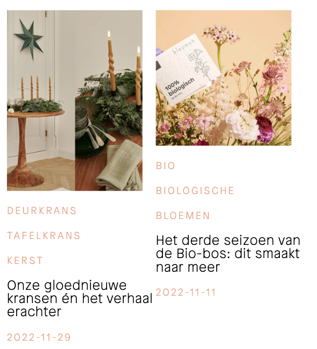

  ### Agenda voor meeting
  Ik wil het graag gaan hebben over het grid van de 2de pagina, ik krijg 1 afbeelding maar niet over de gehele breedte van het scherm. Verder heb ik niet echt dingen die ik tijdens dit feedback moment wil besprekken. Dit komt doordat ik vele vragen gelijk in de les kon stellen en geholpen werd :)

  ### Verslag van meeting
  hier na afloop snel de uitkomsten van de meeting vastleggen

  - Bij het selecter had ik verkeerde waarde gebruik, dus snel aangepast en toen deed hij het.
  - Begin met de micro interactie 
  - Begin met de 5 surfaces planes

## Eindgesprek (week 5)

  
uitwerken voor eindgesprek

  ### Je uitkomst - karakteristiek screenshots:
  bij dit scherm ben ik het meest trost op de foto slider en de dark/light mode
  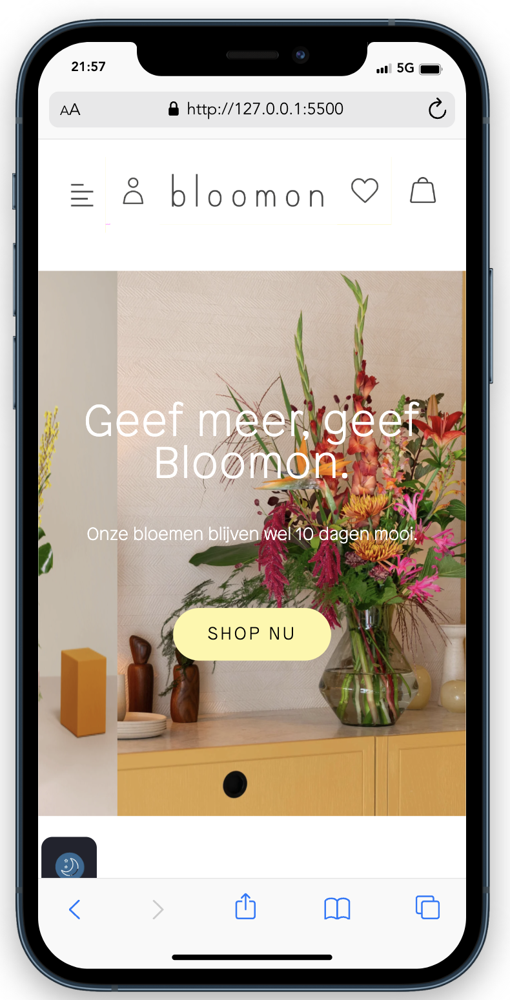

  Bij dit scherm ben ik het meest trots op de toegevoede audio
   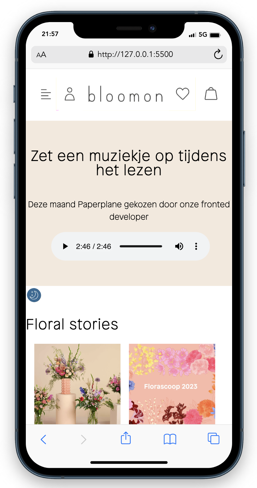

  ### Dit ging goed/Heb ik geleerd: 
  Ik heb geleerd 
 - hoe je met javascript een drop down menu kunt maken
  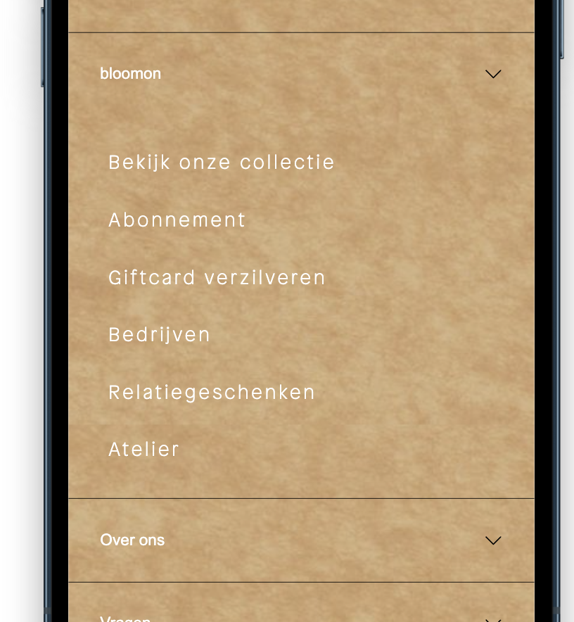

- hoe je audio toevoegd aan de website
  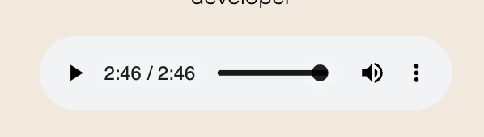

- hoe je beter en gemakkelijker gebruik maakt van grid
  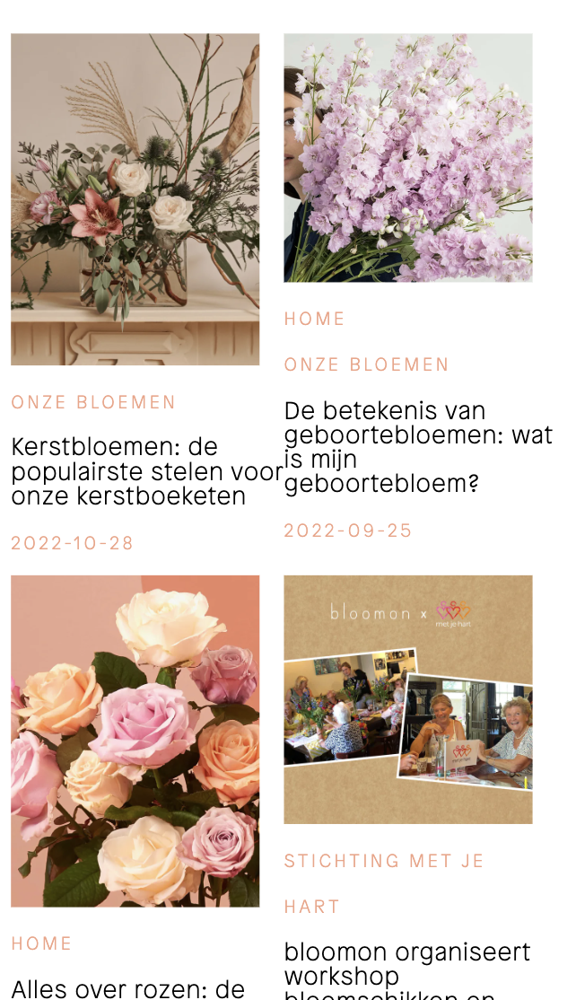

- hoe je een dark/light mode maakt
  

- hoe je gebruik maakt van overflow x

  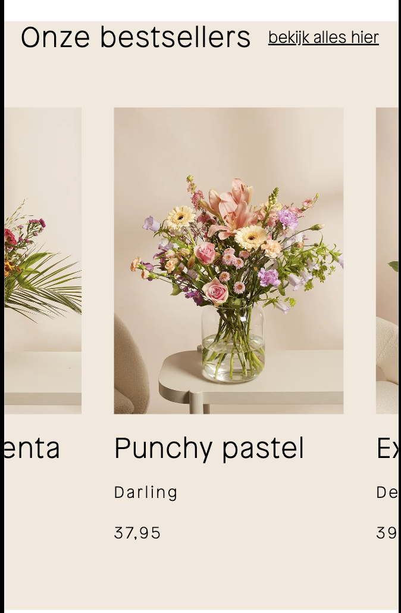

  ### Dit was lastig/Is niet gelukt:
  Ik heb veel problemen gemaakt met het maken en uitzoeken van de micro interactie.

## Bronnenlijst

  
continu bijhouden terwijl je werkt

  Nb. Wees specifiek ('css-tricks' als bron is bijv. niet specifiek genoeg). 
  Nb. ChatGpT en andere AI horen er ook bij.
  Nb. Vermeld de bronnen ook in je code.

  1. Het maken van het drop down menu
     https://www.w3schools.com/howto/howto_js_accordion.asp + Evi
  2. Voor alle informatie van flex
     https://flexboxfroggy.com/#nl
  3. Uitleg over root
    https://www.digitalocean.com/community/tutorials/css-root-pseudo-class
  4. toevoegen van audio
    https://html-site.nl/html-les-8-muziek-site/
  5. het gebruikte liedje in he audio stuk
    https://www.bensound.com/royalty-free-music/track/paper-plane-guitar-romantic
  6. zon en maan iconen dark/light mode
    https://www.freepik.com/premium-vector/day-night-icon-sun-orange-background-moon-stars-midnight-vector-illustration_31763696.htm
  7. uitleg video darkmode
    https://www.youtube.com/watch?v=9LZGB3OLXNQ
  8. uitleg over het maken van de micro interactie
    https://chat.openai.com/?model=text-davinci-002-render-sha + uitleg op papier Marten + Evi
  9. overflow(x): scroll Tessa bedacht.
  10. formulier
    https://www.youtube.com/watch?v=sGQSz22U8VM
  11. loader bij het formulier
    https://cssloaders.github.io

